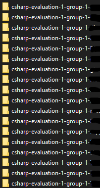
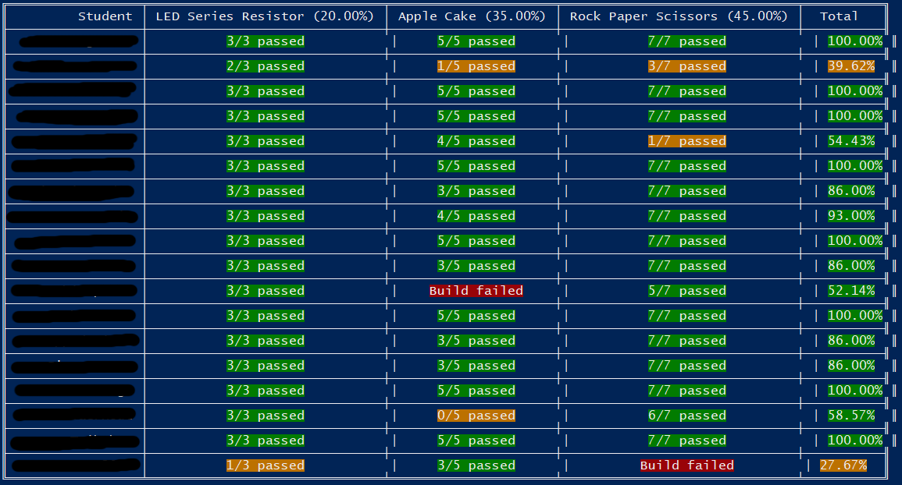

# .NET Grader

Grading app for the assignments of students. It basically runs all the unit tests of the assignments and grades accordingly.

Grading coefficients and assignments to include can all be configured using a json config file.

## Usage

In most cases you'll want to create a directory holding all the assignments of the students as shown next.



Next create a `grade.json` file in the root project directory.

Example:

```json
{
  "evaluation": {
    "name": "C# first assignment",
    "repo_prefix": "csharp-evaluation-1-group-1-",
    "assignments": [
      {
        "title": "LED Series Resistor",
        "skip": false,
        "weight": 0.2,
        "dir": "LEDSeriesResistor"
      },
      {
        "title": "Apple Cake",
        "skip": false,
        "weight": 0.35,
        "dir": "AppleCake"
      },
      {
        "title": "Rock Paper Scissors",
        "skip": false,
        "weight": 0.45,
        "dir": "RockPaperScissors"
      }
    ]
  }
}
```

Once the grading is finished the results are outputted to the terminal.



### Options

By default the tools looks for a `grade.json`file. However another file can be selected via the options:

```bash
grade --config assignment1.json
```

To generate a feedback file for each student, just enable the `--feedback`flag:

```bash
grade --feedback
```

In this case a `feedback.md` file is generated in each student repo dir.

## Development

Use link while developing:

```shell
npm link
```

Next install (links to the place where u ran the link command):

```shell
npm install -g link
```

Run it:

```shell
grade
```
